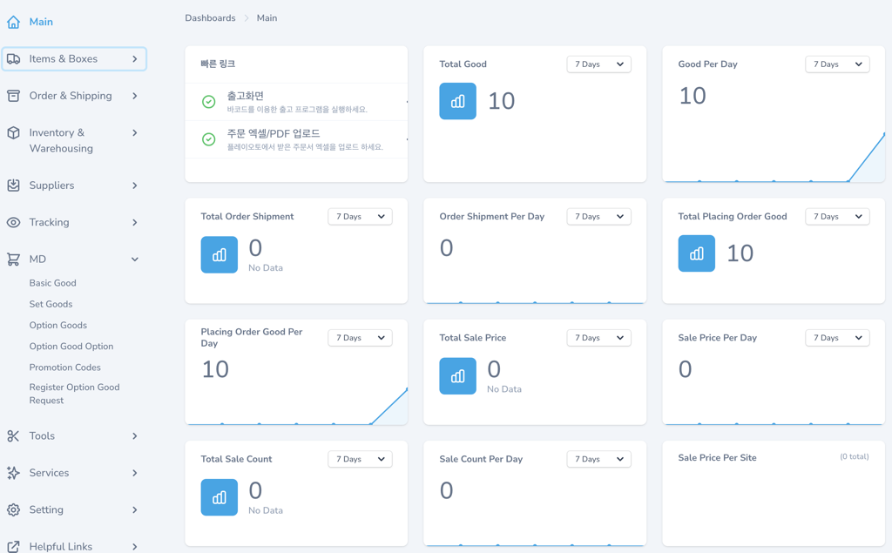

# AI Pro - Smart WMS Solution

[](https://github.com/cable8mm/aipro/actions/workflows/run-tests.yml)
[](https://github.com/cable8mm/aipro/actions/workflows/code-style.yml)
[](https://github.com/cable8mm/aipro)


AIPro is a solution designed for companies with warehouses to keep their WMS (Warehouse Management System) and product information up-to-date, providing this information effectively to vendors and customers. It leverages AI technology and mobile tools to enhance operational convenience and deliver cost-efficient services.

*Main page*

*Goods List*

*API Documents*

## Installation

[Install valet](https://laravel.com/docs/10.x/valet#installation):

```sh
composer global require laravel/valet

echo "export PATH=~/.composer/vendor/bin:$PATH" >> ~/.bashrc
source ~/.bashrc

valet install
```

Cloning:

```sh
cd ~/Sites

git clone https://github.com/cable8mm/aipro.git

cd aipro
```

Setting:

```sh
composer install # install Project

php artisan storage:link # for uploading images and files

valet secure # set https

valet use; # setup php@8.2

composer global update; # update global composer

npm install # install npm libraries

valet open # visit https://aipro.test
```

Database:

- Database : aipro

```sh
php artisan migrate

php artisan nova:user

# make Name, Email Address, Password and create user
```

You'd better use not mysql but sqlite while you has developed.

Mail:

```sh
brew install mailpit

brew services start mailpit
```

Visit to <http://localhost:8025>

## Maintenance

### API Testing

You would visit <https://aipro.test/docs/api> when you wanna test your apis

### Add languages

```sh
php artisan lang:add jp
```

Refer to [this link](https://laravel-lang.com/available-locales-list.html#lists-available-locales-am) about it.

## Test

```sh
composer test
```

## Build

Development:

```sh
npm run dev
```

Production:

**Push must be done in Production state.**

```sh
npm run prod
```

## CI/CD

For testing third party integration, you should make github repository secrets as belows.

*Laravel Nova* is required,

- NOVA_PASSWORD
- NOVA_USERNAME

*Google Login* is optional for social logins,

- GOOGLE_CLIENT_ID
- GOOGLE_CLIENT_SECRET

*Facebook Login* is optional for social logins,

- FACEBOOK_CLIENT_ID
- FACEBOOK_CLIENT_SECRET

*Kakao Login* is optional for social logins,

- KAKAO_CLIENT_ID
- KAKAO_CLIENT_SECRET

Additionally, *Github*, *Instagram* and *Naver* are supported to login.

The stage server is automatically deployed in Merge, and the live server is deployed manually at [Envoy](https://envoyer.io/). However, you must first create a GitHub Release before live deployment.
